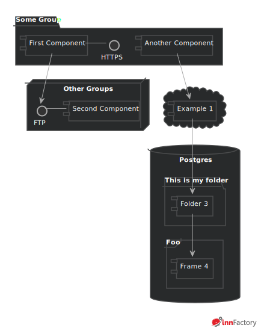
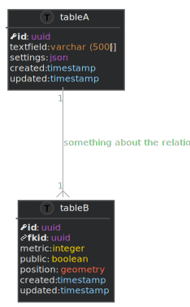
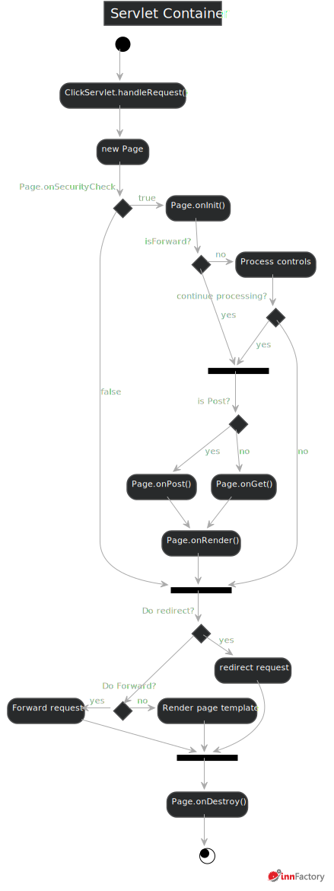
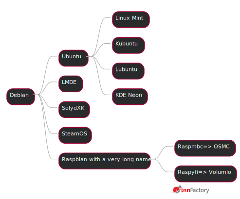
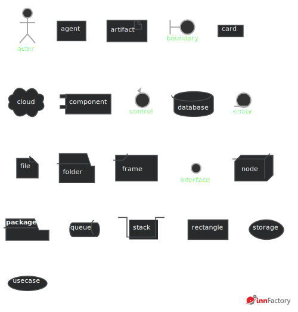
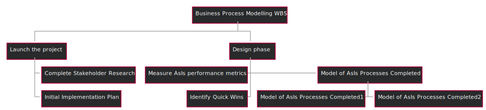

# plantuml-ifstyle
innFactory PlantUML Styling for awesome uml diagrams.

# Usage
Install [plantuml](https://plantuml.com/) and the vscode plugin. 

Add this to the top of your .puml file after @startuml:

```plantuml
!define DARK
!define COLOREDTYPES
!define WATERMARK
!includeurl https://raw.githubusercontent.com/innFactory/plantuml-ifstyle/master/innfactorystyle.puml
```

You can switch to light theme by define LIGHT instead of DARK. If you don't need the colored typed like in the database diagram just remove COLOREDTYPES definition. If you want to remove the watermark just remove the WATERMARK definition. The default font is "Roboto". You have to install it first. Sometimes the style tag does not work. You can remove it when you define NOSTYLE.

# Examples
Example Code under /examples.

## Grouped Components


## Datebase


## Activity
### Simple


### Compley parallel


## Mindmap


## Deployment Items


## WBS


# Credits
[innFactory.de](https://innfactory.de)